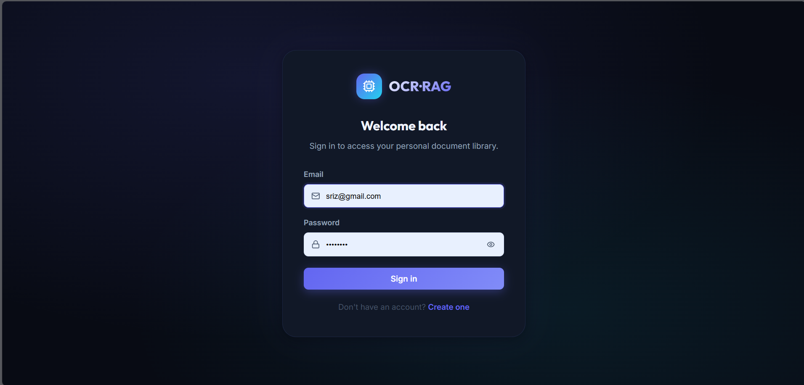
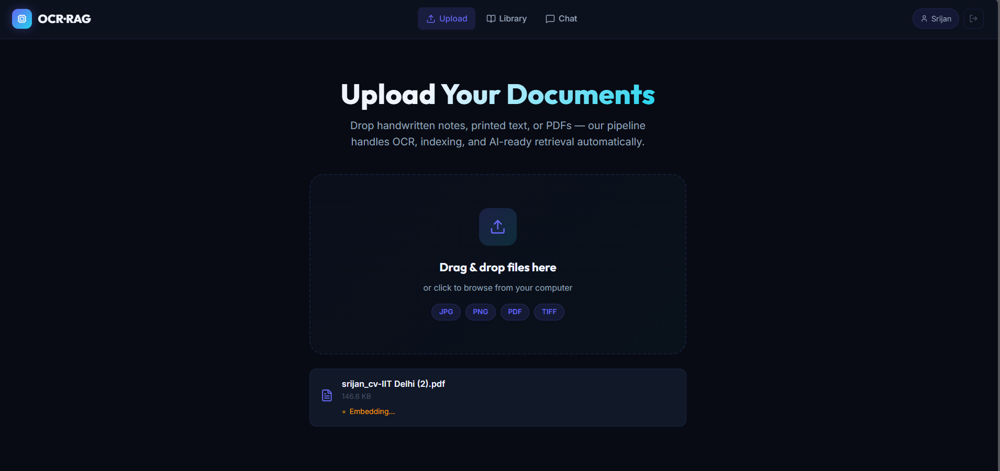
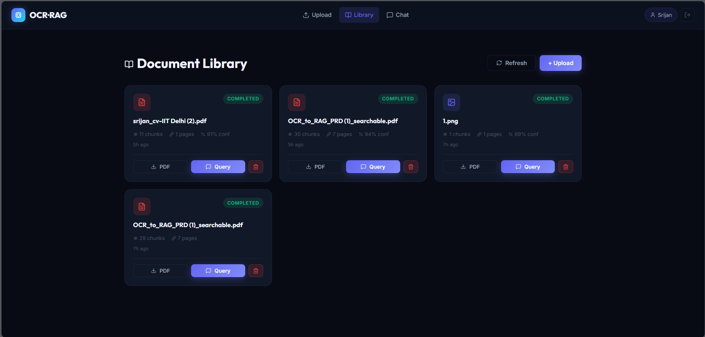
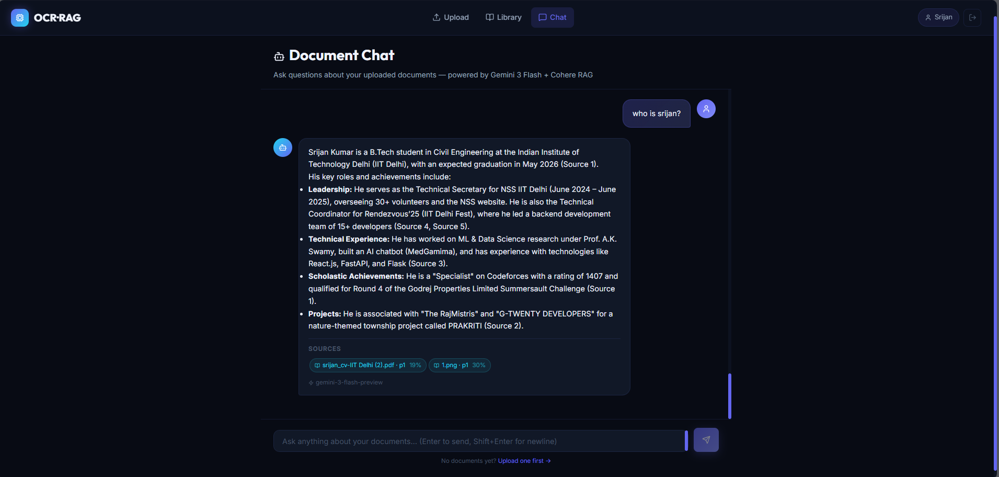
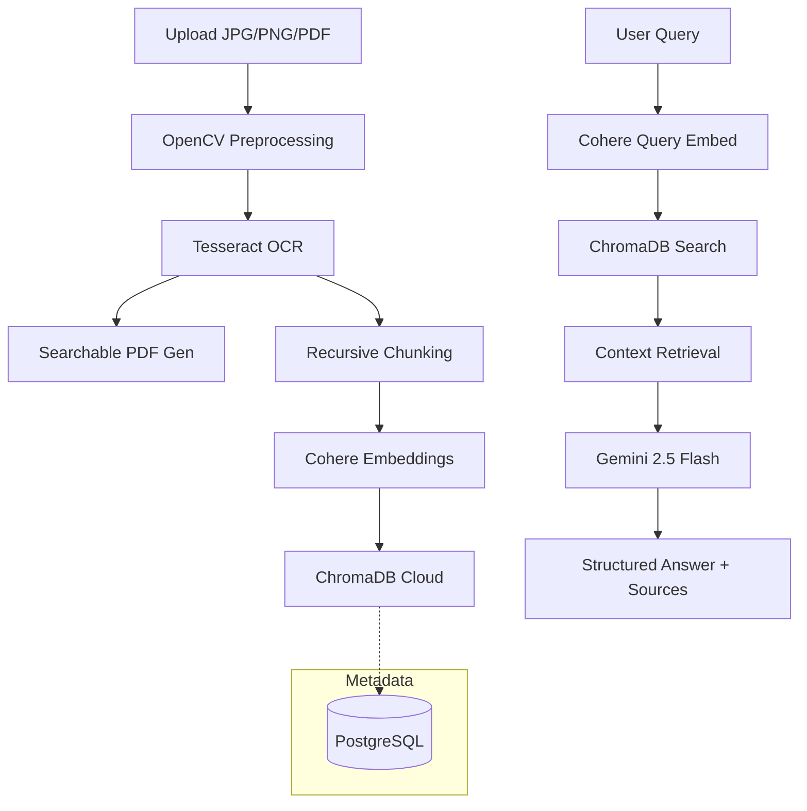

# OCR-to-RAG Document Processing Pipeline

A high-performance, full-stack pipeline to transform images, PDFs, and handwritten notes into searchable, AI-ready knowledge bases.

## 🚀 Overview

- **Intelligent OCR**: Preprocesses images (OpenCV) for maximum Tesseract accuracy.
- **Searchable PDFs**: Generates PDFs with invisible text overlays for traditional search.
- **RAG Brain**: Powered by **Gemini 2.5 Flash** for grounded answers and **Cohere** for semantic retrieval.
- **Cloud-Ready Store**: Uses **ChromaDB Cloud** for serverless vector management and **PostgreSQL** for metadata.
- **Secure**: JWT-based authentication with per-user data isolation.
- **Modern UI**: Dark glassmorphism dashboard built with React and Vite.

## 📸 Screenshots

| Login Page | Upload Dashboard |
|:---:|:---:|
|  |  |

| Document Library | Chat Interface |
|:---:|:---:|
|  |  |

## 🏗️ Architecture



## 🛠️ Tech Stack

| Layer | Technology |
|---|---|
| **Backend** | FastAPI (Python 3.11) |
| **Frontend** | React + Vite + Lucide Icons |
| **OCR/Vision** | Tesseract + OpenCV + Poppler |
| **Vector DB** | ChromaDB Cloud (Client/Server) |
| **RAG/LLM** | Gemini 2.5 Flash + Cohere V3 |
| **Database** | PostgreSQL + SQLAlchemy (Async) |
| **Auth** | JWT (python-jose + passlib) |

## ⚙️ Setup

### Prerequisites
- Docker & Docker Compose
- [Tesseract OCR](https://github.com/UB-Mannheim/tesseract/wiki) (for OCR engine)
- [Poppler](https://poppler.freedesktop.org/) (required by `pdf2image` for PDF-to-image conversion)
- API Keys: Google AI Studio (Gemini) & Cohere

### 1. Rapid Start (Docker)
The easiest way to run the full stack:
```bash
# Clone and enter the project
cd OcrToRag

# Set your API keys in the environment or a .env file
# (See .env.example for required fields)

docker-compose up --build
```
- **Frontend & API**: http://localhost:8000
- **Postgres**: localhost:5432

---

### 2. Manual Setup (Local Development)

The fastest local way to run the project is using the root orchestrator:

```bash
# 1. Install all dependencies (Root, Frontend, Backend)
npm run install:all

# 2. Configure environment
# Copy backend/.env.example to backend/.env and fill in your keys

# 3. Run both services concurrently
npm run dev
```

#### Running Components Individually (Optional)
If you prefer to run them in separate terminals:

**Backend:**
```bash
cd backend
python -m venv venv
venv\Scripts\activate # venv/bin/activate on Mac/Linux
pip install -r requirements.txt
uvicorn main:app --reload
```

**Frontend:**
```bash
cd frontend
npm install
npm run dev
```

## 🔑 Environment Variables

| Variable | Description |
|---|---|
| `GEMINI_API_KEY` | Google AI Studio Key |
| `COHERE_API_KEY` | Cohere API Key |
| `JWT_SECRET_KEY` | 32+ char random string for Auth |
| `DATABASE_URL` | Postgres `asyncpg` URL |
| `CHROMA_API_KEY` | ChromaDB Cloud Token |
| `CHROMA_TENANT` | ChromaDB Tenant ID |
| `CHROMA_DATABASE` | ChromaDB DB Name |

## 📖 Usage Guide

1. **Sign Up**: Create an account. Your data is isolated from other users.
2. **Upload**: Drag & drop any image or PDF. Monitor real-time status (Preprocess -> OCR -> Embed).
3. **Explore**: Visit the **Library** to download generated searchable PDFs or delete docs.
4. **Chat**: Ask questions in the **Chat** tab. The AI will cite source chunks with similarity scores.

## 📂 Project Structure
- `/backend`: FastAPI service, OCR logic, and RAG orchestrator.
- `/frontend`: React application source code.
- `/storage`: Managed storage (mapped during Docker run).
- `Dockerfile`: Unified multi-stage build.
- `docker-compose.yml`: Simplified single-container orchestration.
